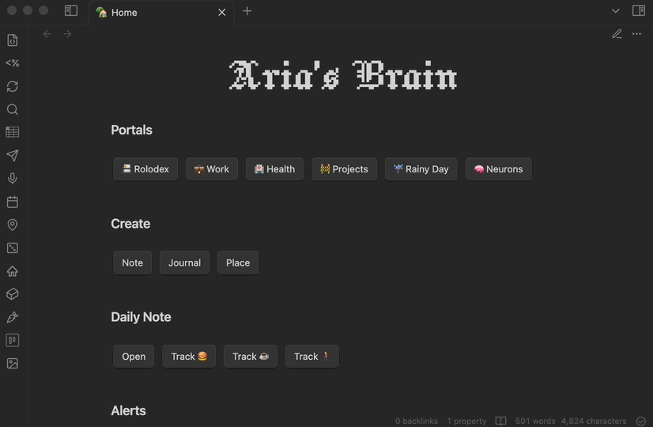

# 📷 Image Picker

Image Picker is a _blazingly_ fast way to browse and find media in your Obsidian vault. It's **extremely performant**, automatically generating thumbnails and background indexing your vault for instant search results.



🐙 [GitHub](https://github.com/AriTheElk/obsidian-image-picker) | 📖 [Docs](https://ari.the.elk.wtf/obsidian/plugins/image-picker) | 💝 [Donate](https://ari.the.elk.wtf/donate)

# ⚙️ Settings

- **Image Folder**: The highest root folder that you want Image Picker to search for images in. If you store your attachments in a specific folder, please select it for better performance.
- **Animate Gifs**: Whether or not to animate gifs in the preview. Disabling this will improve performance if you have a lot of gifs in your vault.
- **Debug Mode**: Enable this to see helpful debug logs in the console. Please use this if you're experiencing issues and want to report them.
- **Reset Image Index**: Click this button to reset the image index and reload Obsidian. This will force Image Picker to re-index your vault, which is useful if you've changed your `Image Folder`.

# 🗺️ Roadmap

- [x] Performantly browse photos across your vault
- [x] Search for photos by name and extension
- [x] Background image indexing for instant search results
- [x] Automatically generate thumbnails for images
- [ ] Support for renaming images
- [ ] Support local LLMs for generating searchable descriptions
- [ ] Index and search for images by metadata, such as location, date, and more
- [ ] Support for video and audio files

# 🛠️ Contributing

Quick start:

```bash
# Clone the repository
git clone https://github.com/AriTheElk/obsidian-image-picker
cd obsidian-image-picker

# Install the dependencies
npm install

# To build the plugin
npm run build

# If you want to build the plugin directly into your vault
echo "/ABSOLUTE/PATH/TO/YOUR/VAULT" > .env
npm run build:vault
```

This will clone the repository, install the dependencies, and build the plugin. If you've set the path correctly, the plugin should be available in your Obsidian vault. It copies to `{vault}/.obsidian/plugins/obsidian-image-picker-dev` immediately after building.

If you'd like to help out, I'd recommend checking out the [help wanted](https://github.com/AriTheElk/obsidian-image-picker/issues?q=is%3Aissue+is%3Aopen+label%3A%22help+wanted%22) tag 🫶🏻

I'm eternally grateful for any help I get :)

# 👩‍⚖️ License

Obsidian Image Picker is licensed under the MIT License. See [LICENSE](LICENSE.md) for more information.
